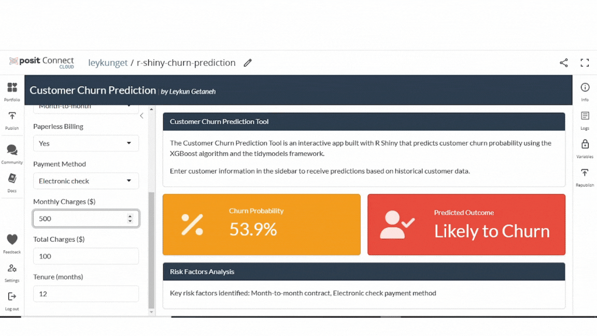

# Customer Churn Prediction App (R Shiny App)

## Overview

The Customer Churn Prediction App is an interactive tool built with R Shiny that predicts customer churn. This application employs the `XGBoost` algorithm, integrated with the `tidymodels` framework, to analyze customer attributes and behaviors, providing insights into churn probability.

## Features

- **User-Friendly Interface**: Enter customer details in the sidebar for churn predictions.
- **Accurate Predictions**: Powered by a robust XGBoost model trained on historical data.
- **Interactive Analysis**: Explore how customer attributes affect churn probability.

## Getting Started

### Prerequisites

Ensure you have R installed along with the following packages:

- `shiny`
- `tidyverse`
- `tidymodels`
- `bslib`
- `xgboost`
- `shinyWidgets`

### Installation

Install the required packages:
   ```R
   install.packages(c('shiny', 'tidyverse', 'tidymodels', 'bslib', 'xgboost', 'shinyWidgets'))
   ```
   
### Running the App

Run the app in R:
```R
library(shiny)
shiny::runApp()
```

## Deployment

To deploy on [Connect Cloud](https://connect.posit.cloud/), create a `manifest.json` file with:
```R
rsconnect::writeManifest(appFiles = "app.R")
```

## Usage

Enter customer information in the sidebar to get predictions.

## App Link

Access the app here: [Customer Churn Prediction Tool](https://0193b6f9-2fb2-3ecb-98eb-06390ec0cf9b.share.connect.posit.cloud/)


